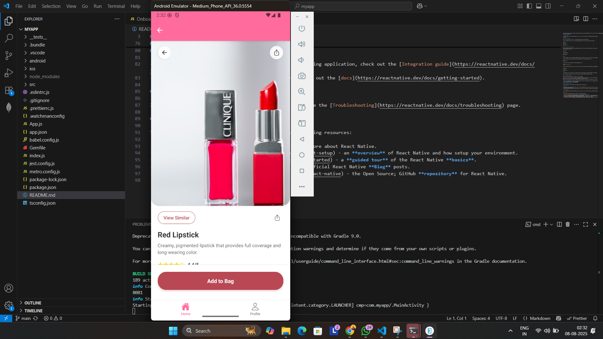
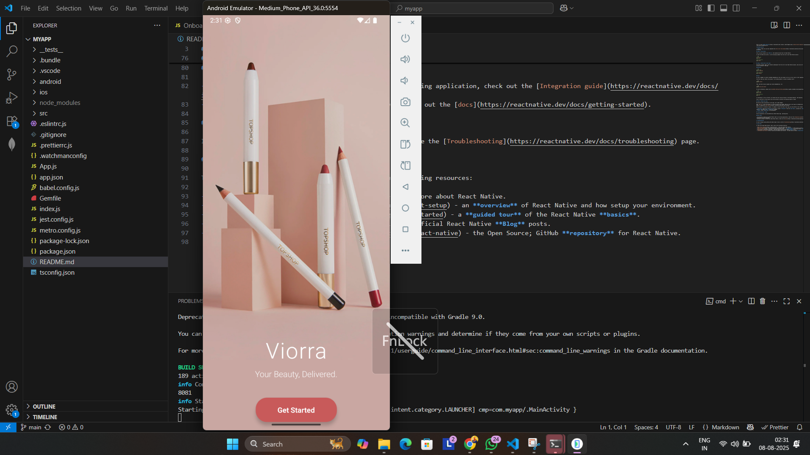
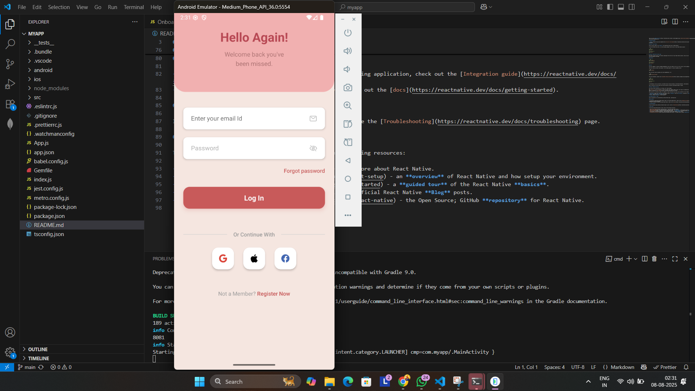
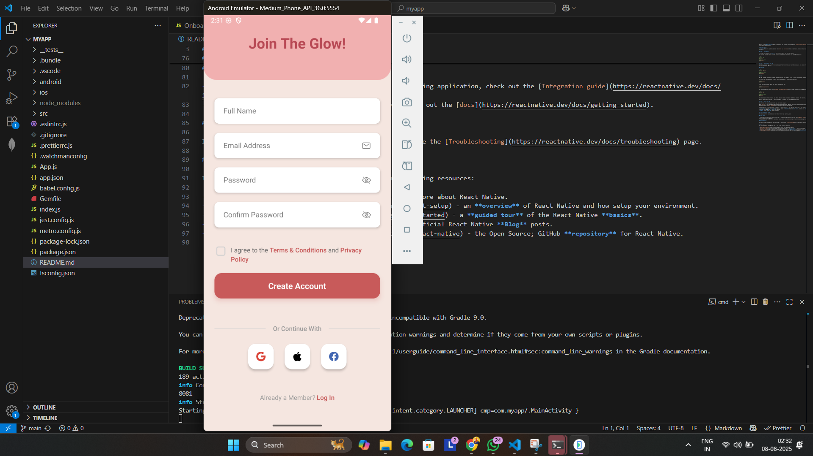
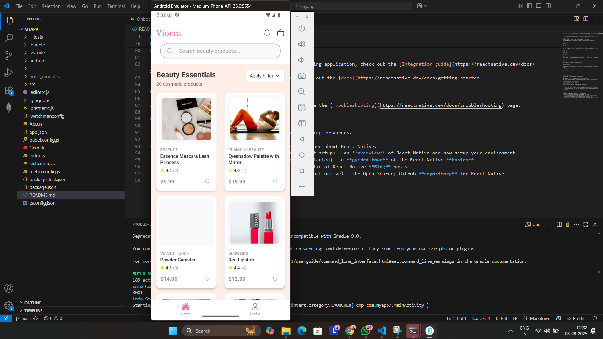
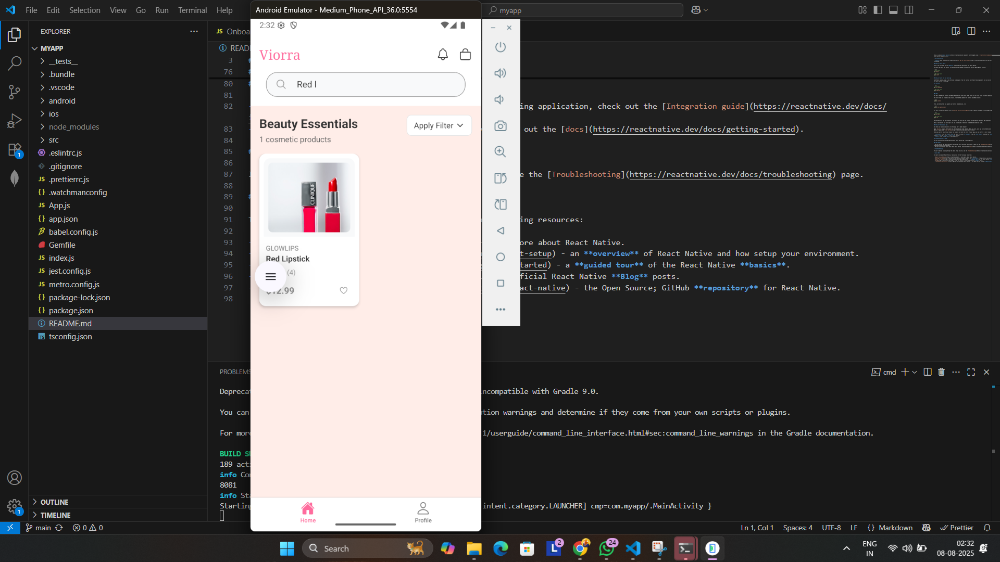
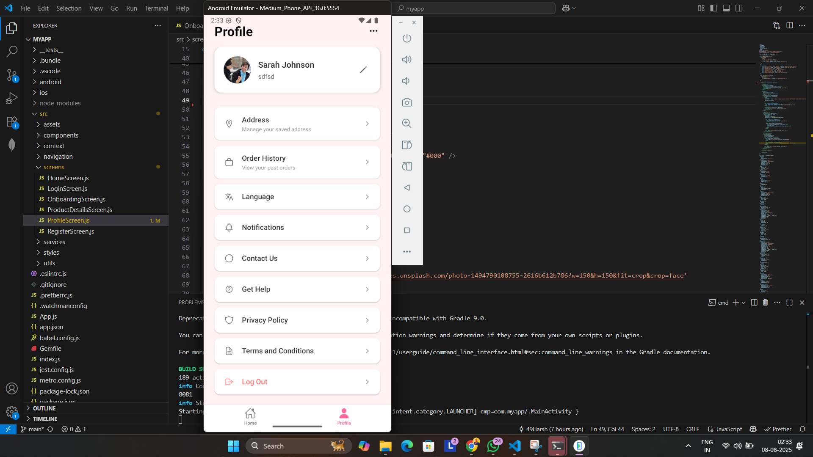

This is a new [**React Native**](https://reactnative.dev) project, bootstrapped using [`@react-native-community/cli`](https://github.com/react-native-community/cli).


first clone from github and then cd to root folder then run this command  = npm i  then = 
### Android

npx react-native run-android

# OR using Yarn
yarn android
```

### iOS

# Using npm
npm run ios

# OR using Yarn
yarn ios
```
# Project Details

### Time Taken
- Initial setup and configuration: 2 hours
- UI development: 4 hours
- Integration and testing: 2 hours
- Total time: Approximately 8 hours
- around 1 and half day 

### Demo Video
You can watch a demonstration of the app's functionality here:
[View Demo Video](https://drive.google.com/file/d/1JjvydZWYRJlwwYOCBPUALbu8Mjc6MQb8/view?usp=drive_link)

### Screenshots/GIFs
Here are the screenshots from the application:









### Assumptions and Known Issues
1. Assumptions:
   - User has a stable internet connection
   - All products have valid image URLs
   - Prices are in USD

2. Known Issues:
   - Image loading might be slow on slower networks
   - Search functionality is case-sensitive
   - Limited offline capabilities

# Troubleshooting

If you're having issues getting the above steps to work, see the [Troubleshooting](https://reactnative.dev/docs/troubleshooting) page.

# Learn More

To learn more about React Native, take a look at the following resources:

- [React Native Website](https://reactnative.dev) - learn more about React Native.
- [Getting Started](https://reactnative.dev/docs/environment-setup) - an **overview** of React Native and how setup your environment.
- [Learn the Basics](https://reactnative.dev/docs/getting-started) - a **guided tour** of the React Native **basics**.
- [Blog](https://reactnative.dev/blog) - read the latest official React Native **Blog** posts.
- [`@facebook/react-native`](https://github.com/facebook/react-native) - the Open Source; GitHub **repository** for React Native.
